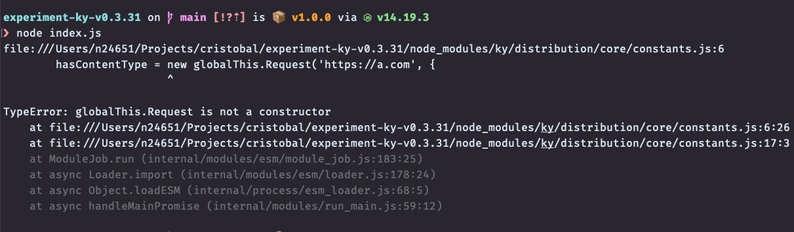
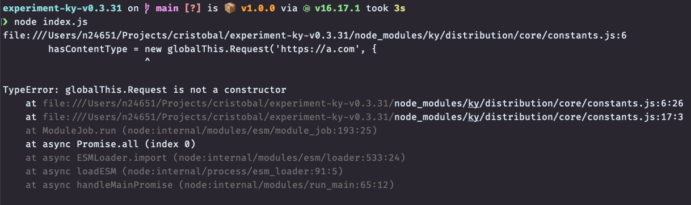
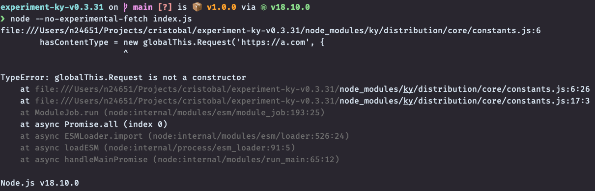

# experiment-ky-v0.31
This experiment branch is here to show the issue around `globalThis.Request` introduced in Ky v0.31, 
when running on the server side.

## The Problem
The problem is the following in [core/constants.ts](https://github.com/sindresorhus/ky/blob/da40323e903fb943c9192e4a43f9dc601d16a5e8/source/core/constants.ts#L7)
That `globalThis.Request` is not defined in Ky.

Even when we import `ky` from the `ky-universal` module it fails hard on node 14 and 16. And it will also fail on node 18 under certain criterias:

## The Code
The code that we run is nothing more than this in the `index.js` file:
```js
import ky from "ky-universal";
```

### Node 14
Will always fail on Node 14:


### Node 16
Will always fail on Node 16:


### Node 18
Will fail on Node 18 if run with the `--no-experimental-fetch` flag:

